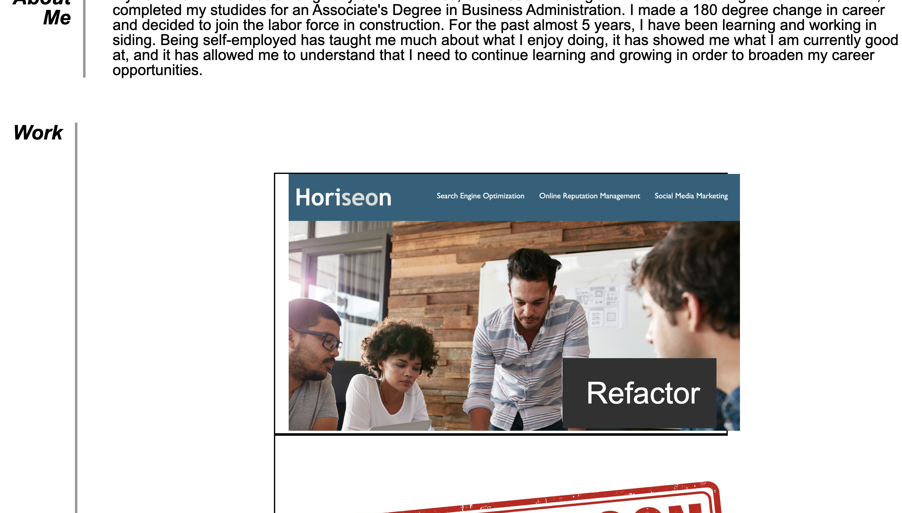
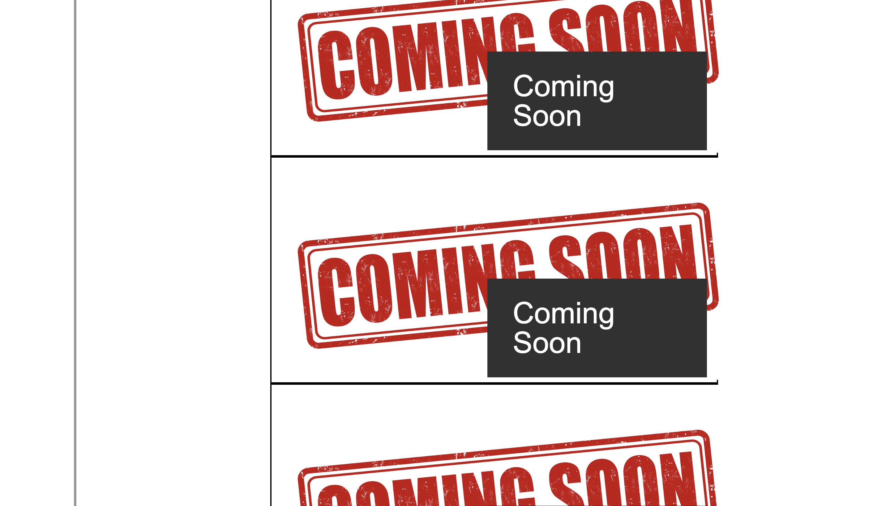
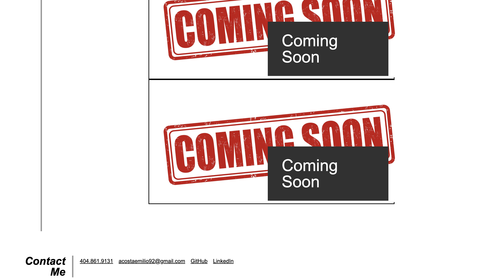

## 02 Advanced CSS: Personal Portfolio

Here is a screenshot of my website:

## Functionality
The top nav bar has links that lead to the different sections in the page.
Each project is represented by a picture, which has a link that takes the user to the deployed page of the project.
